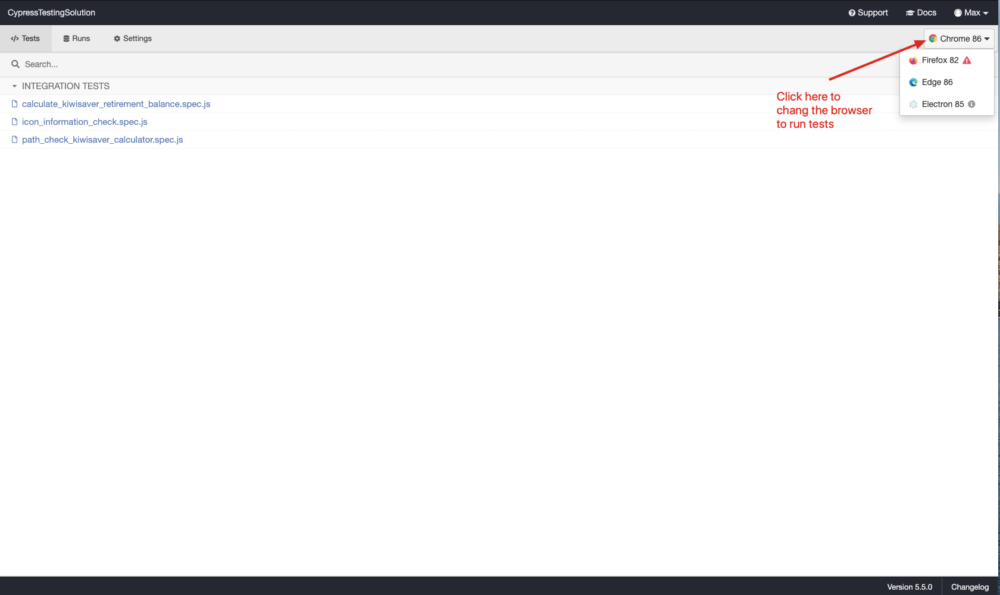
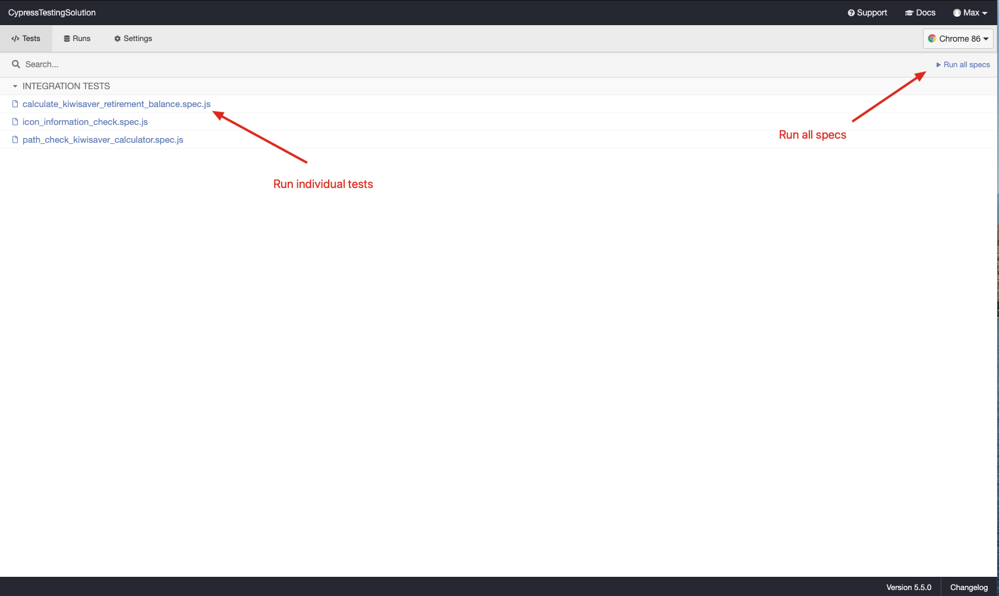
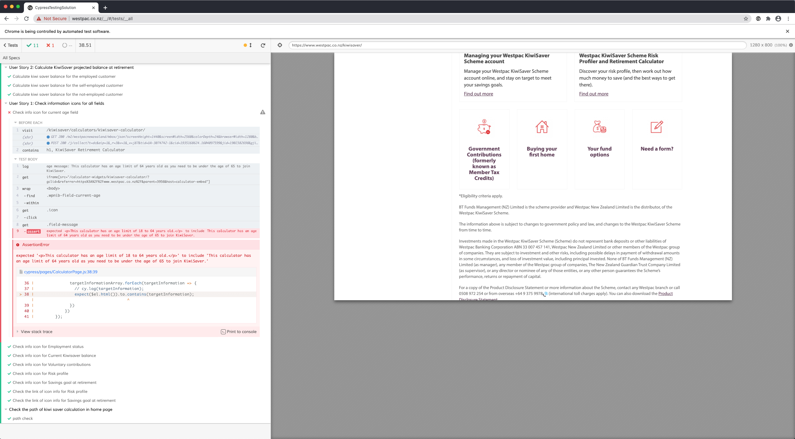
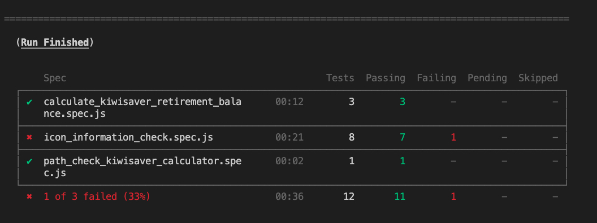
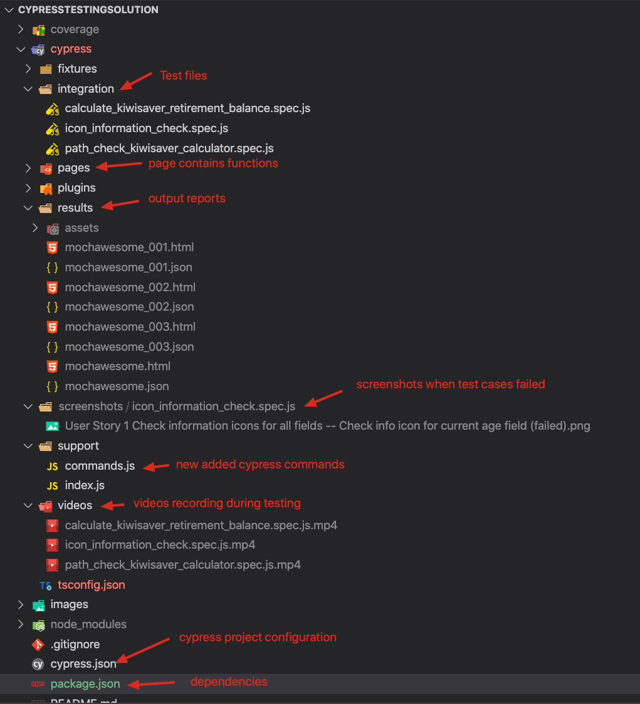
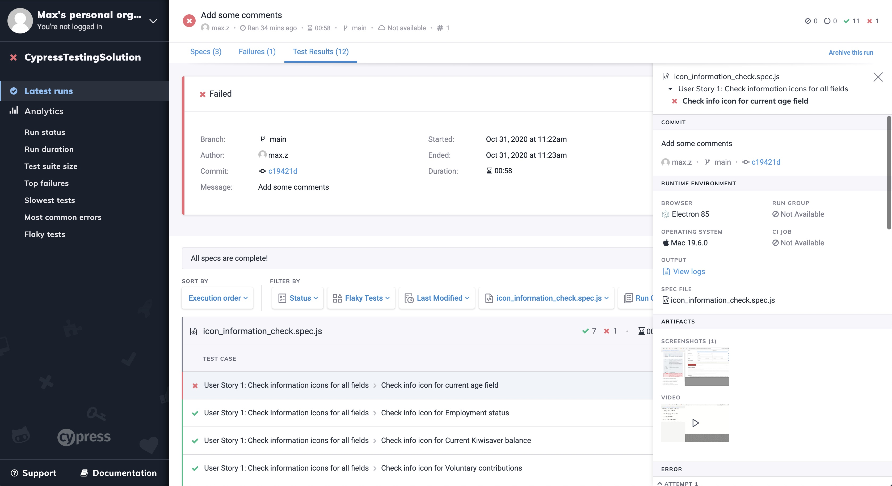

# CypressSolutionTesting
This is an end to end example automation testing solution by using Cypress and Javascript language. Cypress is a next generation end to end testing tool built for the modern web. With it, tests can be faster, easier and more reliable.

You can find more details in https://docs.cypress.io/guides/overview/why-cypress.html#In-a-nutshell


## Prerequisites
+ Nodejs 
  
  Windows install: [https://nodejs.org/en/download/package-manager/#windows]
  
  MacOS install: [https://nodejs.org/en/download/package-manager/#macos]

  Other OSs install: [https://nodejs.org/en/download/package-manager/]

+ Browsers 
  
  Chrome: Version 86.0.4240.111 

  Firefox: Version 82.0.2 

## Git clone the repo to local directory
```
cd /your/project/path
git clone https://github.com/MaxnzWZ/CypressSolutionTesting.git (through https)
or
git clone git@github.com:MaxnzWZ/CypressSolutionTesting.git (through ssh) 
``` 
## Install Cypress and other dependencies on local machine
```
cd /your/project/path/CypressSolutionTesting
npm install
```
## Verify installed Cypress
```
npx cypress version
npx cypress verify
```
## Run Cypress testing
### Run with Cypress test runner
#### Step 1. Open Cypress test runner
```
npx cypress open
```

#### Step 2. Select the available browers installed in your local computer to run the testing


#### Step 3. Select the individual test suite to run or select to run all test suites



### Run Cypress testing by using command
#### Run all test cases in headless mode
```
npx cypress run --headless --browser chrome (headless run with chrome)
npx cypress run --headless --browser firefox (headless run with firefox)
```
#### Run tests specifying a single test file to run instead of all tests
```
npx cypress run --spec "cypress/integration/path_check_kiwisaver_calculator.spec.js"
```
#### Run tests with Cypress Dashboard [https://docs.cypress.io/guides/dashboard/introduction.html#Features]
##### The [Cypress Dashboard](https://on.cypress.io/dashboard) is a service that gives you access to recorded tests - typically when running Cypress tests from your [CI provider](https://docs.cypress.io/guides/guides/continuous-integration.html#Examples). The Dashboard provides you insight into what happened when your tests ran.
```
npx cypress run --record --key d3c5d06d-20cf-4671-ae56-9d9378128b0b
```
Test results (logs, screenshots, videos) can be checked in the project folder in Cypress Dashboard server.
https://dashboard.cypress.io/projects/jzq43t


## Check result
### Check in testrunner


### Check in console


### Check screenshots and output report in local project (after run testing with command line)


### Check test result in Cypress dashboard
https://dashboard.cypress.io/projects/jzq43t


## Cypress documentation
https://docs.cypress.ios